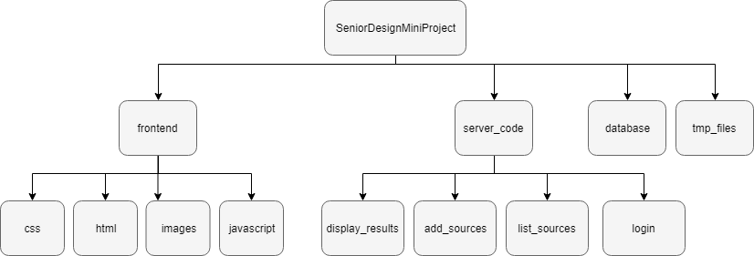

# Senior Design Software Mini Project

Web application that plots temperature and humidity data for users. Each user may have multiple sources that log data into a database. User authentication completed using Google authentication. 

## Authentication

Google authentication

## Database and Table Design

The database is implemented with SQlite3. 

The database contains a table called 'temprh'.
The table consists of the following query keys:
* userid = Unique ID for the user
* source = Source number
* label = Name of the source, determined by the user
* time = Time for which the temperature and humidity is associated with
* temp = Temperature for specified time
* humdity = Humidity for specified time

| userid | source | label | time | temp | humidity |
|:------:|:------:|:-----:|:----:|:----:|:--------:|
| 0001 | 1 | Source1 | 1 | 40 | 50 |
| 0001 | 1 | Source1 | 2 | 43 | 49 |
| 0001 | 1 | Source1 | ... | - | - |
| 0001 | 1 | Source1 | 24 | 47 | 52 |
| 0001 | 2 | SourceTWO | 1 | 60 | 12 |
| 0002 | 1 | Source5 | 1 | 2 | 80 |

This table format allows for logging the temperature and humidity over a 24 hour time period for the user's source. Each entry in the table represents the temperature and humidity for a single hour.

All SQLite queries are parameterized queries, which sanitizes all input.  

## WebApp Design

We implemented a custom web server in python (web_server.py) that binds to port 80 and
handles all incoming URLs from any client.

The diagram for the architecture is below.


The architecture will now be explained in further detail.
### frontend
Code for the frontend of the webapp. 
#### css
CSS files used in the html files. 
#### html
HTML files for the following pages:
* Login
* Add sources
* Sources added confirmation
* List sources
* Display results
* 404 
#### images
Contains the background image for the login page.
#### javascript
Contains javascript for logging in and logging out.
### server_code
Python code for the server side of the webapp. 
#### add_sources
Adds a source with a user-defined label for a user.
#### display_results
Displays the temperature and humidity plots if database query is successful. If query is unsuccessful, user will be sent to the 404 page. 
#### list_sources
Queries for and lists all sources that the user owns.
#### login
Logs in the user using Google authentication.

### database
Database python file.

### tmp_files
Stores generated plots. All files are deleted upon user logout. 

## Testing and Verification

We have tested several edge cases, which include:

### testing for random URLs: we have a 404 page implemented if the user accidently goes to a page that doesn't exist

### checking if the user request to display a source is valid: we check for empty results on database queries (i.e., if the user requests to display a source that isn't in the database) and return a 404 page on invalid requests.

### sanitizing inputs for database: SQL injection is a real threat to any SQL database. We mitigate any such malicious injection queries by using parametrized queries that sanitize the input.

### authentication: multiple users can access the webapp and access only the sources belonging to the user, i.e. listing sources only lists the logged in user's sources.

### deleting cached files: the tmp_files folder contains all temperature and humidity plots that are saved during the time the user is logged in. Once the user logs out, all files in tmp_files will be cleared for security purposes.

## Running the Application

### Prerequisites

* Sqlite3

### Run via CMD

```
python -m web_server
```

## Authors

* **June Hua** 
* **Trishita Tiwari**
